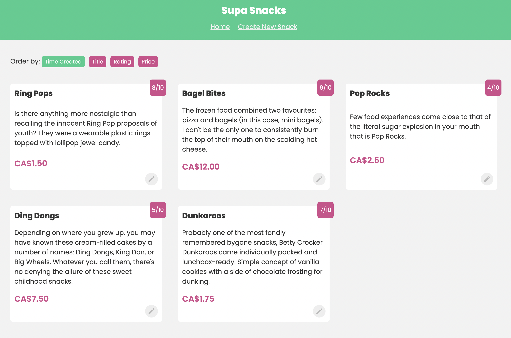

# Supa Snacks

This project is a simple web application that allows users to create, edit, and delete snacks. 

Check it out here: https://supa-snacks.vercel.app/

It served as a learning tool for me to learn how to use the following technologies:

- [TypeScript](https://www.typescriptlang.org/)
- [React-Query](https://react-query.tanstack.com/)
- [Supabase](https://supabase.io/)
- [React Router Dom](https://reactrouter.com/web/guides/quick-start)

I've built many applications with React and `useEffect` and `useState` hooks, but I've never used a library like `react-query` before. I've also never used a database like Supabase before. I'm excited to learn more about these technologies and how they can be used to build better applications.

### Supabase

Supabase is a free and open source alternative to Firebase. It is a hosted Postgres database with a REST API and a realtime websocket API. It also has a dashboard for managing the database.

This was my first time using a hosted database, and I was pleasantly surprised at how easy it was to get started. I was able to create a database, tables, and rows in a matter of minutes. Fetching data from the database was also very easy with the simple syntax. It felt like a combination of Postgres and fetch requests.

```ts
  // fetch snacks query from supabase
  const supabaseQuery = async () => {
    const { data, error } = await supabase.from('snacks').select().order(orderBy, { ascending: true });
    if (error) throw error;
    return data;
  };
```

I setup the row level security to allow all users to *read* data and *insert* new snacks to the database. However, only users with the role of `admin` can *update* and *delete* to the database. 

### React-Query

React-Query is a library that allows you to fetch data from an API and store it in a cache. I used the library to replace the `useEffect` hook that I would normally use to fetch data from an API. 

```ts
  // fetch snacks from supabase
  const { data, isLoading, error, refetch } = useQuery('snacks', supabaseQuery);

  // refetch snacks when change order button is clicked
  const handleClick = (cb: string) => {
    setOrderBy(cb);
    refetch();
  };

```

### Features

| Feature                | Description                                                                                                                                                                                                                                             |
| ---------------------- | ------------------------------------------------------------------------------------------------------------------------------------------------------------------------------------------------------------------------------------------------------- |
| Create Snack           | Users can create a new snack by entering a name and description. Have small amount of error handling in the case a user does not fill all the required fields                                                                                           |
| Change order of snacks | Users can change the order of the snacks by clicking the 'order by' buttons. Causes the `useQuery` to re-render the request with the newly selected option. This was new to me since Supabase is actually returning the data in a new order.            |
| Edit Snack             | Admins can edit a snack by clicking the edit button on the snack card. This will open a modal with the snack's current name and description. Users can then edit the name and description and click the save button to update the snack.                |
| Delete Snack           | Admins can delete a snack by clicking the delete button on the snack card. This triggers a query to Supabase to delete the item with that `id`                                                                                                          |
| Loading State          | Loading state is handled by the `isLoading` boolean from `useQuery`. If the data is loading, a loading message will be displayed. If there is an error, an error message will be displayed. If there is no data, a message will be displayed.           |
| Edit Snack Inputs      | When a user clicks the edit button on a snack card, the snack's name, description, rating, price and locations available at will be filled in the inputs. The user can then edit the snack's information and click the save button to update the snack. |

### Future Features

- [ ] Add authentication. Added row level security to the database to prevent excessive database calls, but would like to add authentication to the application as well.
- [ ] Replace all state management with React-Query. Currently, I'm using `useState` to manage the state of the application. Because this is a small application, I don't think it's necessary to use a state management library like Redux. However, I would like to replace all state management with React-Query in the future.

### Preview


